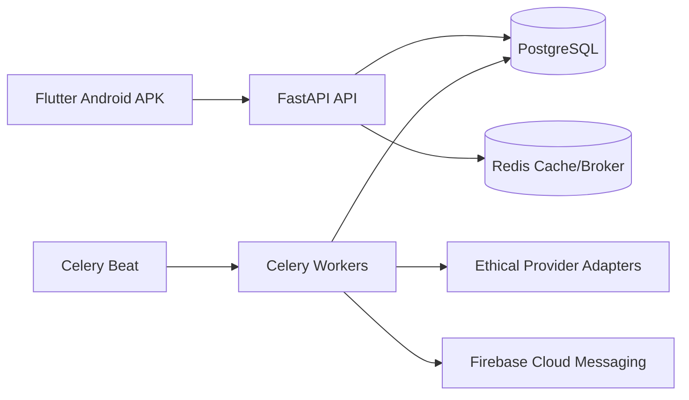

# Blinkit Stock Sentinel

Blinkit Stock Sentinel is an educational Android + FastAPI project for learning how quick-commerce inventory monitoring, wishlist tracking, alerting, analytics, and safe provider integrations can be designed.

> **Ethics notice:** This repository is strictly for education and research. Respect robots.txt, rate limits, and platform ToS. Do not bypass authentication, anti-bot systems, captchas, or security controls. Provider adapters fail closed until you configure public, ToS-compliant live endpoints; the app does not fabricate product availability, price, ETA, or stock changes.

## Architecture



## Backend features

- JWT signup/login and authenticated user APIs.
- Multi-location, wishlist, tracked product, history, analytics, and notification endpoints.
- Async SQLAlchemy architecture with indexed PostgreSQL schema.
- Celery scheduler and worker queue for periodic safe polling.
- Modular live providers for Blinkit, Zepto, and Instamart-style integrations with throttling, rotating headers, retries, exponential backoff, and no captcha/login bypass logic.
- Redis inventory-state hashing, duplicate-alert suppression, request logs, stock-change audit logs, and data-quality gates before notifications.
- SlowAPI request throttling and environment-driven configuration.

## Mobile features

- Flutter Material 3 Android app.
- Splash, login/register, dashboard, product search, wishlist, product detail, location selector, analytics, notification center, settings, and developer debug monitoring screens.
- Dark mode toggle, chart placeholder, push-notification permission declaration, and APK build path.

## Quick start

```bash
cp .env.example .env
docker compose up --build
```

Open API docs at <http://localhost:8000/docs>.

## Build or download the APK

### Download from GitHub Actions

Every push, pull request, or manual workflow run builds an installable debug APK and uploads it as the `blinkit-stock-sentinel-debug-apk` artifact. Open the latest successful **CI** workflow run, scroll to **Artifacts**, and download the APK ZIP. The run summary also prints the artifact URL.

If you need the APK to point at a deployed backend, set the repository variable `API_BASE_URL` before running CI. If unset, the APK uses the Android emulator default `http://10.0.2.2:8000/api/v1`. The app also exposes **Backend API URL** on the login and settings screens so a downloaded APK can be pointed at your real backend without rebuilding. On a physical Android phone, `10.0.2.2` will not reach your computer; use your computer LAN IP, for example `http://192.168.1.10:8000/api/v1`, or a hosted HTTPS API URL.

### Build locally

```bash
cd mobile
flutter pub get
flutter build apk --debug --dart-define=API_BASE_URL=http://10.0.2.2:8000/api/v1
```

The APK will be emitted at `mobile/build/app/outputs/flutter-apk/app-debug.apk`.

## Firebase Cloud Messaging setup

1. Create a Firebase project.
2. Add an Android app with package `com.example.blinkit_stock_sentinel`.
3. Download `google-services.json` into `mobile/android/app/`.
4. Create a service account JSON for backend sending and set `FCM_CREDENTIALS_PATH`.
5. Store user device tokens through the `/auth/me` extension point before sending production pushes.

## Safe provider configuration

Provider classes live under `backend/app/providers/`. There is no mock inventory fallback. Configure live endpoint templates in `.env` before using search or monitoring. Keep:

- `PROVIDER_BASE_DELAY_SECONDS` >= 1.5.
- `PROVIDER_MAX_REQUESTS_PER_MINUTE` conservative.
- No auth bypass, captcha bypass, hidden endpoint abuse, or aggressive parallelism.
- Clear failure logging and opt-out controls.

## API collection

Import `postman/blinkit-stock-sentinel.postman_collection.json` for common auth, search, tracking, and analytics requests.

## Real data validation

See `docs/REAL_DATA_VALIDATION.md` for endpoint-template configuration, debug monitoring mode, raw response verification, polling logs, change logs, Redis snapshot hashing, duplicate-alert prevention, and data-quality checks.
