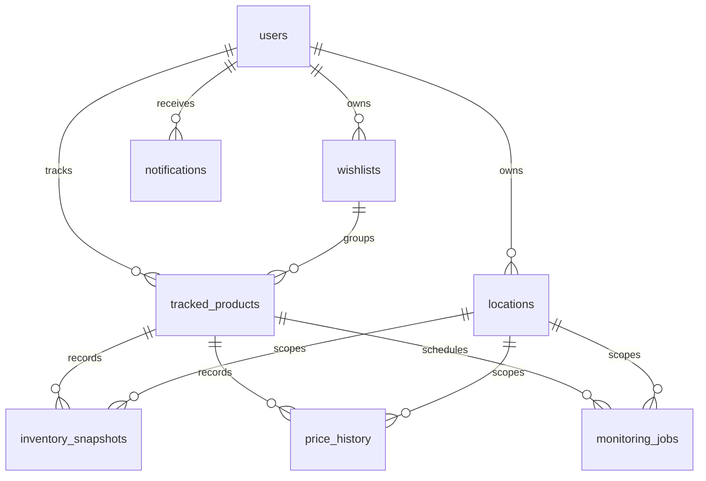

# ER Diagram

The canonical SQL schema is in `infra/postgres/schema.sql` and includes indexes for user lookups, product-location time-series history, due monitoring jobs, and notification filtering.
