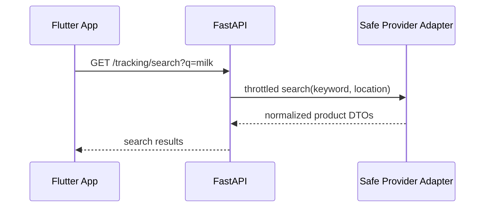
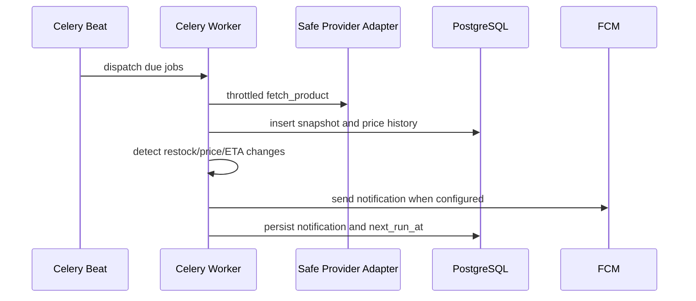

# Sequence Flows

## Product search

```mermaid
sequenceDiagram
  participant App as Flutter App
  participant API as FastAPI
  participant Provider as Safe Provider Adapter
  App->>API: GET /tracking/search?q=milk
  API->>Provider: throttled search(keyword, location)
  Provider-->>API: normalized product DTOs
  API-->>App: search results
```

## Monitoring job

```mermaid
sequenceDiagram
  participant Beat as Celery Beat
  participant Worker as Celery Worker
  participant Provider as Safe Provider Adapter
  participant DB as PostgreSQL
  participant FCM as FCM
  Beat->>Worker: dispatch due jobs
  Worker->>Provider: throttled fetch_product
  Worker->>DB: insert snapshot and price history
  Worker->>Worker: detect restock/price/ETA changes
  Worker->>FCM: send notification when configured
  Worker->>DB: persist notification and next_run_at
```
