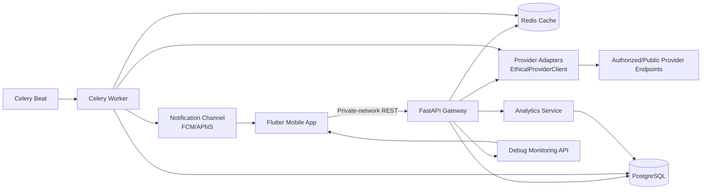
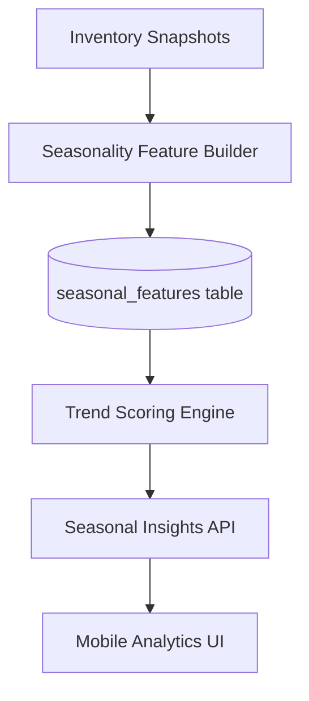

# Blinkit Stock Sentinel — Prototype Project Specification

## 1) Purpose and Educational Scope

Blinkit Stock Sentinel is an **educational inventory-monitoring prototype** for quick commerce, designed to help users learn how real-world stock tracking works without using fake inventory events. The prototype focuses on:

- Seasonal product trend tracking (e.g., festival- or weather-linked demand shifts).
- Reliable restock notifications with anti-noise controls.
- Analytics that explain inventory behavior and user tracking outcomes.
- Real-data-only integration and ethical provider access.

This specification extends the existing FastAPI + Flutter architecture and aligns with repository safeguards requiring live endpoint configuration and fail-closed behavior when endpoints are absent.

---

## 2) Product Goals

### Primary goals
1. **Educational clarity:** Teach users how inventory moves across locations and time.
2. **Operational reliability:** Deliver restock alerts with low false positives.
3. **Actionable analytics:** Explain which products, locations, and times produce successful tracking outcomes.
4. **Ethical compliance:** Only use authorized/publicly observable endpoints with respectful request behavior.

### Non-goals (prototype phase)
- Guaranteed perfect stock prediction.
- Bypass-based scraping (auth bypass, CAPTCHA bypass, aggressive botting).
- Multi-provider legal review automation.

---

## 3) Existing Constraints and Compliance Baseline

The prototype must preserve and build on current repository behavior:

1. **Fail-closed real data policy:** No dummy product feed, no fabricated stock states, no simulated notifications in production flows.
2. **Configured live endpoints required:** Search and polling stop with explicit configuration errors if provider URLs are missing.
3. **Debug observability:** Monitoring endpoints/screens expose source URL, latency, response excerpt, headers, and change state for verification.
4. **Ethical provider base client:** Throttling, randomized delay, retries with backoff, and no anti-bot circumvention.

---

## 4) Reference Architecture

## 4.1 High-level component diagram



## 4.2 Seasonal intelligence extension



Seasonality is derived from observed historical patterns and calendar context (weekday/weekend, month, festival windows), not synthetic assumptions.

---

## 5) Data Model Additions (Prototype)

## 5.1 New tables

1. **seasonal_features**
   - `id`, `tracked_product_id`, `location_id`, `date_bucket`
   - `in_stock_ratio_7d`, `in_stock_ratio_30d`
   - `avg_price_7d`, `avg_price_30d`
   - `restock_count_30d`, `stockout_count_30d`
   - `season_tag` (e.g., `summer`, `monsoon`, `diwali_window`, nullable)
   - `confidence_score` (0–1)

2. **seasonal_alert_preferences**
   - `id`, `user_id`, `wishlist_id`
   - `enable_seasonal_digest` (bool)
   - `digest_frequency` (`daily`/`weekly`)
   - `preferred_time_local`

3. **analytics_events** (lightweight product telemetry)
   - `id`, `user_id`, `event_type`, `event_payload_json`, `created_at`
   - Used for educational insights (e.g., “alerts acted on”, “views after restock”).

## 5.2 Derived views/materialized views

- `mv_restock_velocity_by_hour`
- `mv_location_availability_heatmap`
- `mv_user_alert_effectiveness`

These power low-latency analytics endpoints.

---

## 6) API Design (Prototype Additions)

Base path: `/api/v1`

1. **Seasonal trends**
   - `GET /analytics/seasonal/trends?item_id=&location_id=&window=90d`
   - Returns stock trend line, restock cadence, confidence score, season tags.

2. **Seasonal comparisons**
   - `GET /analytics/seasonal/compare?item_id=&location_id=&baseline=last_year_same_window`
   - Compares current window vs baseline (when enough real data exists).

3. **Alert effectiveness**
   - `GET /analytics/user/alert-effectiveness`
   - Returns open/view/track-again indicators and average time-to-action.

4. **Educational explanation endpoint**
   - `GET /analytics/explain/restock-probability?item_id=&location_id=`
   - Returns transparent factors (not black-box score only).

5. **Seasonal preferences**
   - `GET/PUT /users/me/seasonal-preferences`

---

## 7) Restock Notification Logic (Enhanced)

## 7.1 Event pipeline
1. Poll live provider endpoint.
2. Persist raw snapshot.
3. Compute state hash + compare with Redis state.
4. Detect transitions (out-of-stock -> in-stock, price drop, ETA shift).
5. Confirm restock with second live check.
6. Deduplicate with configurable suppression window.
7. Send alert + persist notification audit row.

## 7.2 Quality controls
- Confidence threshold before push alerts.
- Cooldown per product/location pair.
- Optional “quiet hours” by user timezone.
- Failure logging with status code and last successful sample time.

---

## 8) Ethical Scraping and Data Integrity Requirements

The integration must remain real and ethical:

1. Only query endpoints the team is authorized to access.
2. Respect terms, robots-equivalent constraints, and fair-use expectations.
3. No credential stuffing, no CAPTCHA bypass, no private API reverse-engineering for abuse.
4. Keep conservative request rates and jittered delays.
5. Provide audit trail: source endpoint, timestamp, latency, headers, response excerpt.
6. Fail closed on missing endpoint configuration or schema drift.
7. Provide explicit user-facing disclosure that data freshness depends on provider availability and network conditions.

---

## 9) User Stories

## 9.1 Learner persona
1. As a learner, I want to track one product across multiple locations so I can observe supply volatility.
2. As a learner, I want an explanation of why a restock alert fired so I can understand monitoring logic.
3. As a learner, I want seasonal charts so I can relate demand patterns to calendar periods.

## 9.2 Practical shopper persona
4. As a user, I want restock notifications only when confidence is high to reduce noise.
5. As a user, I want to set quiet hours so I am not disturbed overnight.
6. As a user, I want digest summaries of seasonal changes on my wishlist.

## 9.3 Maintainer persona
7. As an operator, I want debug visibility into provider latency and failures so I can trust alert quality.
8. As an operator, I want hard failure when endpoint config is missing so fake data never leaks.
9. As an operator, I want per-provider throttling controls so integration remains ethical.

---

## 10) Mobile UI Prototype and Mockups

## 10.1 Information architecture
- Dashboard
- Search & Track
- Wishlist
- Product Detail
- Seasonal Insights
- Notifications
- Debug Monitoring (developer-focused)
- Settings

## 10.2 Wireframe mockups (text prototype)

### A) Dashboard

```text
+--------------------------------------------------+
| Blinkit Stock Sentinel                           |
| [Location: Koramangala]   [Last Sync: 2m ago]    |
+--------------------------------------------------+
| Tracked Items: 12       Alerts Today: 3          |
| Restock Success Rate: 68%                        |
+--------------------------------------------------+
| Seasonal Highlights                              |
| - Coconut Water: +22% restock velocity (summer)  |
| - Curd 500g: evening stockout risk rising        |
+--------------------------------------------------+
| [Search Product] [Wishlist] [Analytics] [Debug]  |
+--------------------------------------------------+
```

### B) Product detail + trend card

```text
+--------------------------------------------------+
| Product: Amul Taaza Milk 1L                      |
| Status: OUT OF STOCK (Location A)                |
| Last Seen In Stock: 08:42 PM                     |
+--------------------------------------------------+
| Trend (90 days)                                  |
| in-stock ratio: 0.61  | avg restock gap: 5.2 hrs |
| season tag: summer-high-demand                   |
+--------------------------------------------------+
| Why this score?                                  |
| - Frequent evening stockouts in last 14 days     |
| - Higher weekend recovery than weekdays          |
+--------------------------------------------------+
| [Enable Restock Alert] [Compare Locations]       |
+--------------------------------------------------+
```

### C) Seasonal insights screen

```text
+--------------------------------------------------+
| Seasonal Insights                                |
| Window: [30d v]  Compare: [Last Year v]          |
+--------------------------------------------------+
| Heatmap: Availability by hour/day                |
| (visual grid placeholder)                        |
+--------------------------------------------------+
| Restock Cadence                                  |
| Monsoon Snacks: 1.8x restock frequency           |
| Summer Drinks: 2.1x evening demand spikes        |
+--------------------------------------------------+
| [Explain Method] [Export CSV]                    |
+--------------------------------------------------+
```

### D) Notification settings

```text
+--------------------------------------------------+
| Notifications                                    |
+--------------------------------------------------+
| [x] Restock alerts                               |
| [x] Price drop alerts                            |
| [ ] ETA improvement alerts                        |
| Quiet Hours: 11:00 PM - 7:00 AM                  |
| Confidence Threshold: [High  v]                  |
| Seasonal Digest: [Weekly v]                      |
+--------------------------------------------------+
| [Save Preferences]                               |
+--------------------------------------------------+
```

---

## 11) Analytics Strategy

## 11.1 User-facing metrics
- In-stock ratio by item/location/window.
- Median restock interval.
- Alert-to-availability action window.
- Price trend and volatility band.
- Seasonal uplift/drop index.

## 11.2 Educational explainability
Every major chart includes:
- “How computed” microcopy.
- Sample size and confidence indicator.
- Data freshness timestamp.
- Link to debug provenance for advanced users.

---

## 12) Delivery Plan

## Phase 1 — Foundations (1–2 sprints)
- Add schema/table migrations.
- Implement seasonal feature builder batch job.
- Add new analytics endpoints.
- Add minimal Seasonal Insights screen.

## Phase 2 — Notifications + UX (1 sprint)
- Add confidence gating and quiet hours.
- Add digest preferences and scheduler integration.
- Improve explanation cards in product detail.

## Phase 3 — Validation + hardening (1 sprint)
- Data QA checks for drift and null bursts.
- Monitoring dashboards + alerting on provider failures.
- Load tests with ethical throttling limits.

---

## 13) Acceptance Criteria

1. System never emits fabricated inventory transitions in production path.
2. Seasonal trend endpoints return only computed values from persisted snapshots.
3. Restock alerts include confidence and provenance metadata.
4. Debug API can show the latest upstream call details for tracked items.
5. Mobile app renders seasonal trend cards and explanation blocks.
6. Ethical throttle settings cap request volume as configured.

---

## 14) Risks and Mitigations

1. **Provider schema changes** -> strict parser + structured error + fail closed.
2. **Noisy stock flips** -> two-step restock confirmation + cooldown windows.
3. **Sparse historical data for seasonality** -> confidence gating + “insufficient data” UX.
4. **User over-trust in forecasts** -> educational disclaimers and transparent factors.

---

## 15) Success Metrics (Prototype)

- Alert precision (confirmed useful alerts / total alerts).
- Reduction in duplicate/noise alerts.
- Weekly active learners viewing analytics screens.
- Percentage of charts with high-confidence sample size.
- Provider failure recovery time.

